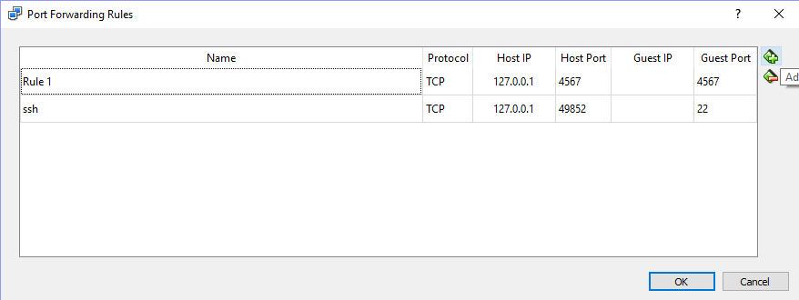
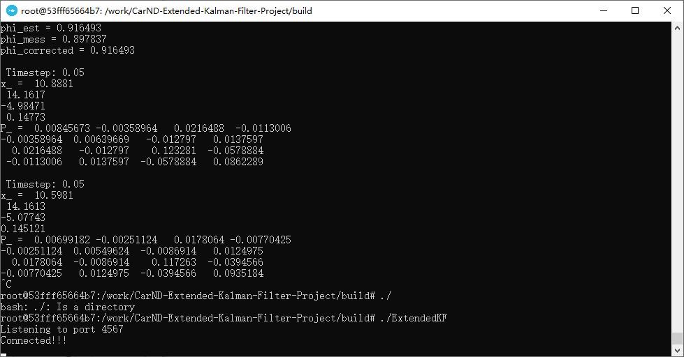
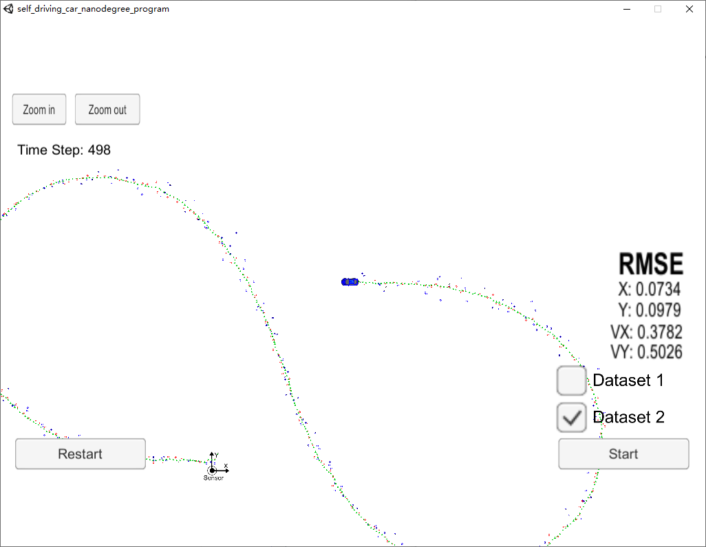

# Extended Kalman Filter Project
Self-Driving Car Engineer Nanodegree Program

In this project I have utilized a kalman filter to estimate the state of a moving object of interest with noisy lidar and radar measurements. The obtaining RMSE values should be lower than the tolerance outlined in the project rubric. 

## Environment set-up
This project involves the Term 2 Simulator which could be downloaded from [here](https://github.com/udacity/self-driving-car-sim/releases).

The controller prgramm is running in Docker Image, to run the Image with dependencies requried by this project, use the following command in Docker Quickstart Terminal:
_docker run -it --name <yourNameHere> -p 4567:4567 -v ‘pwd’:/work udacity/controls_kit:latest_

For security reasons, the VM does not automatically open port forwarding, so we need to manually enable port 4567. This is needed for the C++ program to successfully connect to the host simulator.

Port Forwarding Instructions
 1. First open up Oracle VM VirtualBox
 2. Click on the default session and select settings.
 3. Click on Network, and then Advanced.
 4. Click on Port Forwarding
 5. Click on the green plus, adds new port forwarding rule.
 6. Add a rule that assigns 4567 as both the host port and guest Port, as in the screenshot.

## Build and run
After installations and configurations are done, run the following command to build and run the program:
 1. mkdir build && cd build
 3. cmake ..
 4. make
 5. ./ExtendedKF

After seeing "Connected!!!"

we can start the simulator and choose EKF project to run.

## Simulating result
The result is demonstrated in the figure, the blue circles with direction indicators are measurements, red circles are the actual trajectory and green triangles stands for the trajectory estimated by EKF. The RMSE is printed in simulator also

